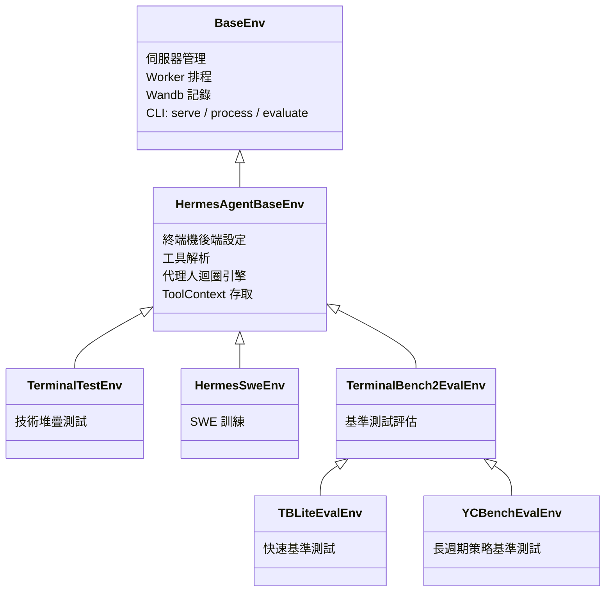

# 環境、基準測試與資料生成

Hermes Agent 包含一個完整的環境框架，將其工具呼叫能力與 [Atropos](https://github.com/NousResearch/atropos) 增強學習 (RL) 訓練框架相連結。這實現了三種工作流程：

1. **RL 訓練** — 使用 GRPO 在多輪代理人任務上訓練語言模型
2. **基準測試** — 在標準化的代理人基準測試上評估模型
3. **資料生成** — 從代理人的執行軌跡（Rollouts）生成 SFT 訓練資料

這三者共享相同的核心：一個定義任務、執行代理人迴圈並對輸出進行評分的 **環境 (Environment)** 類別。

:::info 儲存庫環境 vs RL 訓練工具
此處文件說明的 Python 環境框架位於儲存庫的 `environments/` 目錄下，是 Hermes/Atropos 整合的實作層級 API。這與面向使用者的 `rl_*` 工具不同，後者是作為遠端 RL 訓練工作流程的編排介面。
:::

:::tip 快速連結
- **想要執行基準測試？** 跳轉至 [現有的基準測試](#現有的基準測試)
- **想要使用 RL 進行訓練？** 請參閱 [RL 訓練工具](/user-guide/features/rl-training) 以了解代理人驅動的介面，或參閱 [執行環境](#執行環境) 以了解手動執行方式
- **想要建立新環境？** 請參閱 [建立環境](#建立環境)
:::

## 架構

環境系統建立在三層繼承鏈之上：



### BaseEnv (Atropos)

源自 `atroposlib` 的基礎類別。提供：
- **伺服器管理** — 連接至與 OpenAI 相容的 API（VLLM, SGLang, OpenRouter）
- **Worker 排程** — 平行軌跡生成（Rollout）協調
- **Wandb 整合** — 指標記錄與軌跡視覺化
- **CLI 介面** — 三個子命令：`serve`, `process`, `evaluate`
- **評測記錄** — `evaluate_log()` 將結果儲存為 JSON + JSONL 格式

### HermesAgentBaseEnv

Hermes-Agent 層（`environments/hermes_base_env.py`）。新增了：
- **終端機後端設定** — 為沙盒執行（本地、Docker、Modal、Daytona、SSH、Singularity）設定 `TERMINAL_ENV`
- **工具解析** — `_resolve_tools_for_group()` 呼叫 hermes-agent 的 `get_tool_definitions()`，根據啟用/禁用的工具集獲取正確的工具結構（Schemas）
- **代理人迴圈整合** — `collect_trajectory()` 執行 `HermesAgentLoop` 並對結果評分
- **兩階段運作** — 第一階段（OpenAI 伺服器）用於評測/SFT，第二階段（VLLM ManagedServer）用於包含 Logprobs 的完整 RL
- **非同步安全補丁** — 對 Modal 後端進行猴子補丁（Monkey-patch），使其能在 Atropos 的事件迴圈中運作

### 具體環境

您的環境繼承自 `HermesAgentBaseEnv` 並實作五個方法：

| 方法 | 用途 |
|--------|---------|
| `setup()` | 載入資料集，初始化狀態 |
| `get_next_item()` | 回傳下一個要進行軌跡生成的項目 |
| `format_prompt(item)` | 將項目轉換為使用者訊息 |
| `compute_reward(item, result, ctx)` | 對軌跡生成結果進行評分 (0.0–1.0) |
| `evaluate()` | 定期評估邏輯 |

## 核心元件

### 代理人迴圈 (Agent Loop)

`HermesAgentLoop` (`environments/agent_loop.py`) 是一個可重複使用的多輪代理人引擎。它執行與 hermes-agent 主迴圈相同的工具呼叫模式：

1. 透過 `server.chat_completion()` 將訊息 + 工具結構發送至 API
2. 如果回應包含 `tool_calls`，透過 `handle_function_call()` 派發每一個呼叫
3. 將工具結果附加到對話中，回到步驟 1
4. 如果沒有 `tool_calls`，則代理人任務完成

工具呼叫在執行緒池 (`ThreadPoolExecutor(128)`) 中執行，因此非同步後端（Modal, Docker）不會在 Atropos 的事件迴圈內發生死結。

回傳一個 `AgentResult`：

```python
@dataclass
class AgentResult:
    messages: List[Dict[str, Any]]       # 完整對話歷史
    turns_used: int                       # 呼叫 LLM 的次數
    finished_naturally: bool              # 模型是否自行停止（True）
    reasoning_per_turn: List[Optional[str]]  # 提取出的推論內容
    tool_errors: List[ToolError]          # 工具派發期間遇到的錯誤
    managed_state: Optional[Dict]         # VLLM ManagedServer 狀態（第二階段）
```

### 工具上下文 (Tool Context)

`ToolContext` (`environments/tool_context.py`) 讓獎勵函數（Reward functions）能直接存取模型在軌跡生成期間使用的**同一個沙盒**。透過 `task_id` 的範圍限制，所有狀態（檔案、程序、瀏覽器分頁）都會被保留。

```python
async def compute_reward(self, item, result, ctx: ToolContext):
    # 在模型的終端機沙盒中執行測試
    test = ctx.terminal("pytest -v")
    if test["exit_code"] == 0:
        return 1.0

    # 檢查檔案是否已建立
    content = ctx.read_file("/workspace/solution.py")
    if content.get("content"):
        return 0.5

    # 下載檔案進行本地驗證
    ctx.download_file("/remote/output.bin", "/local/output.bin")
    return 0.0
```

可用方法：

| 類別 | 方法 |
|----------|---------|
| **終端機** | `terminal(command, timeout)` |
| **檔案** | `read_file(path)`, `write_file(path, content)`, `search(query, path)` |
| **傳輸** | `upload_file()`, `upload_dir()`, `download_file()`, `download_dir()` |
| **網頁** | `web_search(query)`, `web_extract(urls)` |
| **瀏覽器** | `browser_navigate(url)`, `browser_snapshot()` |
| **通用** | `call_tool(name, args)` — 任何 hermes-agent 工具的逃生口 |
| **清理** | `cleanup()` — 釋放所有資源 |

### 工具呼叫解析器 (Tool Call Parsers)

對於**第二階段** (VLLM ManagedServer)，伺服器會回傳原始文字而非結構化的工具呼叫。位於 `environments/tool_call_parsers/` 的用戶端解析器會從原始輸出中提取 `tool_calls`：

```python
from environments.tool_call_parsers import get_parser

parser = get_parser("hermes")  # 或 "mistral", "llama3_json", "qwen", "deepseek_v3" 等
content, tool_calls = parser.parse(raw_model_output)
```

可用解析器：`hermes`, `mistral`, `llama3_json`, `qwen`, `qwen3_coder`, `deepseek_v3`, `deepseek_v3_1`, `kimi_k2`, `longcat`, `glm45`, `glm47`。

在第一階段（OpenAI 伺服器類型）中，不需要解析器 — 伺服器會原生處理工具呼叫解析。

## 現有的基準測試

### TerminalBench2

包含 **89 個具挑戰性的終端機任務**，並為每個任務提供 Docker 沙盒環境。

| | |
|---|---|
| **測試內容** | 單一任務的程式編寫/系統管理能力 |
| **評分方式** | 二進位 通過/失敗（測試套件驗證） |
| **沙盒** | Modal 雲端沙盒（每個任務獨立 Docker 映像檔） |
| **工具** | `terminal` + `file` |
| **任務數量** | 跨多個類別的 89 個任務 |
| **成本** | 完整評測約 $50–200（平行執行） |
| **時間** | 約 2–4 小時 |

```bash
python environments/benchmarks/terminalbench_2/terminalbench2_env.py evaluate \
    --config environments/benchmarks/terminalbench_2/default.yaml

# 執行特定任務
python environments/benchmarks/terminalbench_2/terminalbench2_env.py evaluate \
    --config environments/benchmarks/terminalbench_2/default.yaml \
    --env.task_filter fix-git,git-multibranch
```

資料集：HuggingFace 上的 [NousResearch/terminal-bench-2](https://huggingface.co/datasets/NousResearch/terminal-bench-2)。

### TBLite (OpenThoughts Terminal Bench Lite)

包含 **100 個經過難度校準的任務** — TerminalBench2 的快速替代方案。

| | |
|---|---|
| **測試內容** | 與 TB2 相同（程式/系統管理），校準後的難度分層 |
| **評分方式** | 二進位 通過/失敗 |
| **沙盒** | Modal 雲端沙盒 |
| **工具** | `terminal` + `file` |
| **任務數量** | 100 個任務：簡單 (40), 中等 (26), 困難 (26), 極限 (8) |
| **相關性** | 與完整版 TB2 的相關係數 r=0.911 |
| **速度** | 比 TB2 快 2.6–8 倍 |

```bash
python environments/benchmarks/tblite/tblite_env.py evaluate \
    --config environments/benchmarks/tblite/default.yaml
```

TBLite 是 TerminalBench2 的精簡子類別 — 僅資料集與逾時設定有所不同。由 OpenThoughts Agent 團隊（Snorkel AI + Bespoke Labs）開發。資料集：[NousResearch/openthoughts-tblite](https://huggingface.co/datasets/NousResearch/openthoughts-tblite)。

### YC-Bench

**長週期策略基準測試** — 代理人扮演一家 AI 新創公司的 CEO。

| | |
|---|---|
| **測試內容** | 跨越數百輪對話的多輪策略連貫性 |
| **評分方式** | 綜合評分：`0.5 × 生存率 + 0.5 × 正規化資金` |
| **沙盒** | 本地終端機（無需 Modal） |
| **工具** | 僅 `terminal` |
| **執行次數** | 預設 9 次（3 個預設集 × 3 個種子碼），循序執行 |
| **成本** | 完整評測約 $50–200 |
| **時間** | 約 3–6 小時 |

```bash
# 安裝 yc-bench (選配依賴)
pip install "hermes-agent[yc-bench]"

# 執行評估
bash environments/benchmarks/yc_bench/run_eval.sh

# 或直接執行
python environments/benchmarks/yc_bench/yc_bench_env.py evaluate \
    --config environments/benchmarks/yc_bench/default.yaml

# 快速單一預設集測試
python environments/benchmarks/yc_bench/yc_bench_env.py evaluate \
    --config environments/benchmarks/yc_bench/default.yaml \
    --env.presets '["fast_test"]' --env.seeds '[1]'
```

YC-Bench 使用 [collinear-ai/yc-bench](https://github.com/collinear-ai/yc-bench) — 一個具有 4 個技能領域（研究、推論、資料環境、訓練）、聲望系統、員工管理與財務壓力的確定性模擬系統。與 TB2 的單一任務二進位評分不同，YC-Bench 測量代理人是否能在數百個複利決策中維持連貫的策略。

## 訓練環境

### TerminalTestEnv

一個包含內置任務（無外部資料集）的極簡自給自足環境。用於**驗證完整技術堆疊**的端對端運作。每個任務要求模型在已知路徑建立檔案；驗證器則檢查內容。

```bash
# 處理模式 (將軌跡儲存至 JSONL，無需訓練伺服器)
python environments/terminal_test_env/terminal_test_env.py process \
    --env.data_path_to_save_groups terminal_test_output.jsonl

# 服務模式 (連接至 Atropos API 進行 RL 訓練)
python environments/terminal_test_env/terminal_test_env.py serve
```

### HermesSweEnv

SWE-bench 風格的訓練環境。模型接收一個程式設計任務，使用終端機 + 檔案 + 網頁工具來解決，且獎勵函數在同一個 Modal 沙盒中執行測試。

```bash
python environments/hermes_swe_env/hermes_swe_env.py serve \
    --openai.model_name YourModel \
    --env.dataset_name bigcode/humanevalpack \
    --env.terminal_backend modal
```

## 執行環境

每個環境都是一個獨立的 Python 指令碼，具有三個 CLI 子命令：

### `evaluate` — 執行基準測試

適用於僅評測環境（基準測試）。執行所有項目，計算指標並記錄至 wandb。

```bash
python environments/benchmarks/tblite/tblite_env.py evaluate \
    --config environments/benchmarks/tblite/default.yaml \
    --openai.model_name anthropic/claude-sonnet-4.6
```

無需訓練伺服器或 `run-api`。環境會處理一切。

### `process` — 生成 SFT 資料

執行軌跡生成並將評分後的軌跡儲存至 JSONL。適用於在沒有完整 RL 迴圈的情況下生成訓練資料。

```bash
python environments/terminal_test_env/terminal_test_env.py process \
    --env.data_path_to_save_groups output.jsonl \
    --openai.model_name anthropic/claude-sonnet-4.6
```

輸出格式：每一行都是一條包含完整對話歷史、獎勵和詮釋資料（Metadata）的評分軌跡。

### `serve` — 連接至 Atropos 進行 RL 訓練

將環境連接至執行中的 Atropos API 伺服器 (`run-api`)。在即時 RL 訓練期間使用。

```bash
# 終端機 1: 啟動 Atropos API
run-api

# 終端機 2: 啟動環境
python environments/hermes_swe_env/hermes_swe_env.py serve \
    --openai.model_name YourModel
```

環境從 Atropos 接收項目，執行代理人軌跡生成，計算獎勵，並將評分後的軌跡發送回訓練伺服器。

## 兩階段運作

### 第一階段：OpenAI 伺服器 (評測 / SFT)

使用帶有 `tools=` 參數的 `server.chat_completion()`。伺服器（VLLM, SGLang, OpenRouter, OpenAI）原生處理工具呼叫解析。回傳包含結構化 `tool_calls` 的 `ChatCompletion` 物件。

- **用途**：評估、SFT 資料生成、基準測試、測試
- **佔位符 Token**：為 Atropos 管線建立（因為 OpenAI API 無法提供真實的 Token ID）

### 第二階段：VLLM ManagedServer (完整 RL)

使用 ManagedServer 透過 `/generate` 獲取精確的 Token ID + Logprobs。用戶端[工具呼叫解析器](#工具呼叫解析器)從原始輸出中重構結構化的 `tool_calls`。

- **用途**：使用 GRPO/PPO 進行完整的 RL 訓練
- **真實 Token**、遮罩（Masks）與 Logprobs 會流經管線
- 在設定中將 `tool_call_parser` 設為符合您模型格式的值（例如：`"hermes"`, `"qwen"`, `"mistral"`）

## 建立環境

### 訓練環境

```python
from environments.hermes_base_env import HermesAgentBaseEnv, HermesAgentEnvConfig
from atroposlib.envs.server_handling.server_manager import APIServerConfig

class MyEnvConfig(HermesAgentEnvConfig):
    my_custom_field: str = "default_value"

class MyEnv(HermesAgentBaseEnv):
    name = "my-env"
    env_config_cls = MyEnvConfig

    @classmethod
    def config_init(cls):
        env_config = MyEnvConfig(
            enabled_toolsets=["terminal", "file"],
            terminal_backend="modal",
            max_agent_turns=30,
        )
        server_configs = [APIServerConfig(
            base_url="https://openrouter.ai/api/v1",
            model_name="anthropic/claude-sonnet-4.6",
            server_type="openai",
        )]
        return env_config, server_configs

    async def setup(self):
        from datasets import load_dataset
        self.dataset = list(load_dataset("my-dataset", split="train"))
        self.iter = 0

    async def get_next_item(self):
        item = self.dataset[self.iter % len(self.dataset)]
        self.iter += 1
        return item

    def format_prompt(self, item):
        return item["instruction"]

    async def compute_reward(self, item, result, ctx):
        # ctx 提供對軌跡生成沙盒的完整工具存取權
        test = ctx.terminal("pytest -v")
        return 1.0 if test["exit_code"] == 0 else 0.0

    async def evaluate(self, *args, **kwargs):
        # 訓練期間的定期評測
        pass

if __name__ == "__main__":
    MyEnv.cli()
```

### 僅評測基準測試

對於基準測試，請遵循 TerminalBench2、TBLite 和 YC-Bench 使用的模式：

1. **建立路徑**：`environments/benchmarks/your-benchmark/`
2. **設定僅評測設定**：`eval_handling=STOP_TRAIN`, `steps_per_eval=1`, `total_steps=1`
3. **虛設訓練方法**：`collect_trajectories()` 回傳 `(None, [])`，`score()` 回傳 `None`
4. **實作** `rollout_and_score_eval(eval_item)` — 每個項目的代理人迴圈 + 評分
5. **實作** `evaluate()` — 編排所有執行，計算總體指標
6. **新增串流 JSONL**：用於防當機的結果持久化
7. **新增清理**：`KeyboardInterrupt` 處理、`cleanup_all_environments()`、`_tool_executor.shutdown()`
8. **使用** `evaluate` 子命令執行

請參閱 `environments/benchmarks/yc_bench/yc_bench_env.py` 以取得乾淨且文件齊全的參考實作。

## 設定參考

### HermesAgentEnvConfig 欄位

| 欄位 | 類型 | 預設值 | 說明 |
|-------|------|---------|-------------|
| `enabled_toolsets` | `List[str]` | `None` (全部) | 啟用哪些 hermes 工具集 |
| `disabled_toolsets` | `List[str]` | `None` | 要過濾掉的工具集 |
| `distribution` | `str` | `None` | 機率性工具集分佈名稱 |
| `max_agent_turns` | `int` | `30` | 每次軌跡生成的最大 LLM 呼叫次數 |
| `agent_temperature` | `float` | `1.0` | 抽樣溫度 |
| `system_prompt` | `str` | `None` | 代理人的系統訊息 |
| `terminal_backend` | `str` | `"local"` | `local`, `docker`, `modal`, `daytona`, `ssh`, `singularity` |
| `terminal_timeout` | `int` | `120` | 每個終端機指令的秒數 |
| `terminal_lifetime` | `int` | `3600` | 沙盒最大壽命 |
| `dataset_name` | `str` | `None` | HuggingFace 資料集識別碼 |
| `tool_pool_size` | `int` | `128` | 工具執行的執行緒池大小 |
| `tool_call_parser` | `str` | `"hermes"` | 第二階段原始輸出的解析器 |
| `extra_body` | `Dict` | `None` | OpenAI API 的額外參數（例如 OpenRouter 供應商偏好） |
| `eval_handling` | `Enum` | `STOP_TRAIN` | `STOP_TRAIN`, `LIMIT_TRAIN`, `NONE` |

### YAML 設定

環境可以透過以 `--config` 傳遞的 YAML 檔案進行設定：

```yaml
env:
  enabled_toolsets: ["terminal", "file"]
  max_agent_turns: 60
  max_token_length: 32000
  agent_temperature: 0.8
  terminal_backend: "modal"
  terminal_timeout: 300
  dataset_name: "NousResearch/terminal-bench-2"
  tokenizer_name: "NousResearch/Hermes-3-Llama-3.1-8B"
  use_wandb: true
  wandb_name: "my-benchmark"

openai:
  base_url: "https://openrouter.ai/api/v1"
  model_name: "anthropic/claude-sonnet-4.6"
  server_type: "openai"
  health_check: false
```

YAML 值會覆寫 `config_init()` 的預設值。CLI 參數則會覆寫 YAML 值：

```bash
python my_env.py evaluate \
    --config my_config.yaml \
    --openai.model_name anthropic/claude-opus-4.6  # 覆寫 YAML
```

## 先決條件

### 針對所有環境

- Python >= 3.11
- `atroposlib`: `pip install git+https://github.com/NousResearch/atropos.git`
- 一個 LLM API 金鑰（OpenRouter, OpenAI, 或自行架設的 VLLM/SGLang）

### 針對使用 Modal 沙盒的基準測試 (TB2, TBLite)

- [Modal](https://modal.com) 帳戶與 CLI：`pip install "hermes-agent[modal]"`
- `MODAL_TOKEN_ID` 與 `MODAL_TOKEN_SECRET` 環境變數

### 針對 YC-Bench

- `pip install "hermes-agent[yc-bench]"` (安裝 yc-bench CLI + SQLAlchemy)
- 無需 Modal — 使用本地終端機後端執行

### 針對 RL 訓練

- `TINKER_API_KEY` — [Tinker](https://tinker.computer) 訓練服務的 API 金鑰
- `WANDB_API_KEY` — 用於 Weights & Biases 指標追蹤
- `tinker-atropos` 子模組 (位於儲存庫的 `tinker-atropos/`)

請參閱 [RL 訓練](/user-guide/features/rl-training) 以了解代理人驅動的 RL 工作流程。

## 目錄結構

```
environments/
├── hermes_base_env.py          # 抽象基礎類別 (HermesAgentBaseEnv)
├── agent_loop.py               # 多輪代理人引擎 (HermesAgentLoop)
├── tool_context.py             # 為獎勵函數提供每輪軌跡的工具存取
├── patches.py                  # 針對 Modal 後端的非同步安全補丁
│
├── tool_call_parsers/          # 第二階段用戶端解析器
│   ├── hermes_parser.py        # Hermes/ChatML <tool_call> 格式
│   ├── mistral_parser.py       # Mistral [TOOL_CALLS] 格式
│   ├── llama_parser.py         # Llama 3 JSON 工具呼叫
│   ├── qwen_parser.py          # Qwen 格式
│   ├── deepseek_v3_parser.py   # DeepSeek V3 格式
│   └── ...                     # + kimi_k2, longcat, glm45/47 等
│
├── terminal_test_env/          # 技術堆疊驗證 (內置任務)
├── hermes_swe_env/             # SWE-bench 訓練環境
│
└── benchmarks/                 # 評估基準測試
    ├── terminalbench_2/        # 89 個終端機任務，Modal 沙盒
    ├── tblite/                 # 100 個校準任務 (快速 TB2 代理)
    └── yc_bench/               # 長週期策略基準測試
```
