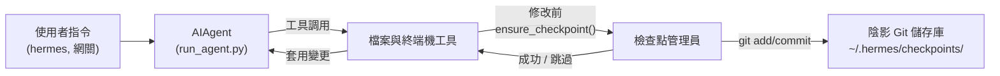

# 檢查點 (Checkpoints) 與 `/rollback`

Hermes Agent 會在執行**破壞性操作**前自動為你的專案建立快照，並允許你透過單一指令還原。檢查點功能**預設為啟用** —— 當沒有觸發檔案修改工具時，該功能不會產生任何開銷。

這個安全網是由內部的**檢查點管理員 (Checkpoint Manager)** 提供支援，它會在 `~/.hermes/checkpoints/` 下維護一個獨立的「陰影 Git 儲存庫 (Shadow Git Repo)」—— 絕不會觸動你專案中真正的 `.git` 目錄。

## 什麼會觸發檢查點

在執行以下操作前會自動建立檢查點：

- **檔案工具** —— `write_file` 與 `patch`
- **具有破壞性的終端機指令** —— `rm`、`mv`、`sed -i`、`truncate`、`shred`、輸出重導向 (`>`)，以及 `git reset`/`clean`/`checkout`

代理程式在**每個對話回合中，針對每個目錄最多建立一個檢查點**，因此長時間的對話階段也不會產生冗餘的快照。

## 快速參考

| 指令 | 描述 |
|---------|-------------|
| `/rollback` | 列出所有檢查點及其變更統計數據 |
| `/rollback <N>` | 還原至檢查點 N (同時也會復原最後一個對話回合) |
| `/rollback diff <N>` | 預覽檢查點 N 與當前狀態之間的差異 (Diff) |
| `/rollback <N> <檔案路徑>` | 從檢查點 N 還原單一檔案 |

## 檢查點的運作方式

高層級運作邏輯如下：

- Hermes 偵測到工具即將**修改工作樹中的檔案**。
- 每個對話回合 (針對每個目錄) 執行一次以下操作：
  - 為該檔案解析出合理的專案根目錄。
  - 初始化或重複使用與該目錄關聯的**陰影 Git 儲存庫**。
  - 暫存 (Stage) 並提交 (Commit) 當前狀態，並附帶簡短的人類可讀原因。
- 這些提交構成了檢查點歷史紀錄，你可以透過 `/rollback` 進行檢查與還原。



## 配置

檢查點功能預設為啟用。請在 `~/.hermes/config.yaml` 中配置：

```yaml
checkpoints:
  enabled: true          # 總開關 (預設值：true)
  max_snapshots: 50      # 每個目錄的最大快照數量
```

若要停用：

```yaml
checkpoints:
  enabled: false
```

停用後，檢查點管理員將不執行任何操作，也不會嘗試進行 Git 操作。

## 列出檢查點

在 CLI 對話中輸入：

```
/rollback
```

Hermes 會回傳一份格式化的列表，顯示變更統計數據：

```text
📸 Checkpoints for /path/to/project:

  1. 4270a8c  2026-03-16 04:36  before patch  (1 file, +1/-0)
  2. eaf4c1f  2026-03-16 04:35  before write_file
  3. b3f9d2e  2026-03-16 04:34  before terminal: sed -i s/old/new/ config.py  (1 file, +1/-1)

  /rollback <N>             還原至檢查點 N
  /rollback diff <N>        預覽自檢查點 N 以來的變更
  /rollback <N> <檔案路徑>  從檢查點 N 還原單一檔案
```

每個條目顯示：

- 簡短雜湊值 (Hash)
- 時間戳記
- 原因 (觸發快照的操作)
- 變更摘要 (修改的檔案數、新增/刪除行數)

## 使用 `/rollback diff` 預覽變更

在執行還原之前，可以先預覽自某個檢查點以來發生了哪些變化：

```
/rollback diff 1
```

這會顯示 Git Diff 統計摘要以及實際的差異內容：

```text
test.py | 2 +-
 1 file changed, 1 insertion(+), 1 deletion(-)

diff --git a/test.py b/test.py
--- a/test.py
+++ b/test.py
@@ -1 +1 @@
-print('original content')
+print('modified content')
```

為了避免洗版，過長的差異內容會限制顯示前 80 行。

## 使用 `/rollback` 進行還原

透過編號還原至特定的檢查點：

```
/rollback 1
```

在幕後，Hermes 會執行以下操作：

1. 驗證目標提交是否存在於陰影儲存庫中。
2. 為當前狀態建立一個**回滾前快照 (Pre-rollback Snapshot)**，以便你稍後可以「撤銷還原」。
3. 還原工作目錄中受追蹤的檔案。
4. **復原上一個對話回合**，使代理程式的上下文與還原後的檔案系統狀態保持一致。

成功後顯示：

```text
✅ Restored to checkpoint 4270a8c5: before patch
A pre-rollback snapshot was saved automatically.
(^_^)b Undid 4 message(s). Removed: "Now update test.py to ..."
  4 message(s) remaining in history.
  Chat turn undone to match restored file state.
```

對話復原功能可確保代理程式不會「記住」已被回滾的變更，從而避免在下一回合產生混淆。

## 單一檔案還原

從檢查點還原單一檔案，而不影響目錄中的其他檔案：

```
/rollback 1 src/broken_file.py
```

當代理程式修改了多個檔案，但你只想還原其中一個時，這項功能非常有用。

## 安全與效能防護

為了確保檢查點功能的安全性與快速執行，Hermes 套用了多項防護措施：

- **Git 可用性** —— 若在環境變數 `PATH` 中找不到 `git`，檢查點功能將自動透明地停用。
- **目錄範圍** —— Hermes 會跳過過於寬泛的目錄 (例如根目錄 `/`、家目錄 `$HOME`)。
- **儲存庫大小** —— 檔案數量超過 50,000 個的目錄將被跳過，以避免 Git 操作過慢。
- **無變更跳過** —— 若自上次快照以來沒有任何變更，則會跳過該檢查點。
- **非致命錯誤** —— 檢查點管理員內部的所有錯誤僅會以偵錯 (Debug) 等級記錄；你的工具將繼續執行。

## 檢查點儲存位置

所有的陰影儲存庫都儲存在以下路徑：

```text
~/.hermes/checkpoints/
  ├── <hash1>/   # 某個工作目錄的陰影 Git 儲存庫
  ├── <hash2>/
  └── ...
```

每個 `<hash>` 是根據工作目錄的絕對路徑生成。在每個陰影儲存庫中，你會發現：

- 標準的 Git 內部檔案 (`HEAD`、`refs/`、`objects/`)
- 一個包含精選忽略清單的 `info/exclude` 檔案
- 一個指向原始專案根目錄的 `HERMES_WORKDIR` 檔案

通常你不需要手動處理這些檔案。

## 最佳實踐

- **保持檢查點啟用** —— 該功能預設開啟，且在沒有檔案被修改時不會產生任何開銷。
- **還原前先使用 `/rollback diff`** —— 預覽變更以挑選正確的檢查點。
- **優先使用 `/rollback` 而非 `git reset`** —— 當你只想撤銷由代理程式驅動的變更時。
- **結合 Git 工作樹使用** —— 獲得最高安全性。將每個 Hermes 對話保持在獨立的工作樹/分支中，並將檢查點作為額外的防護層。

關於在同一個儲存庫上並行執行多個代理程式，請參閱 [Git 工作樹 (Git Worktrees)](./git-worktrees.md) 指南。
