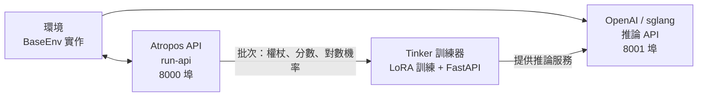

# 強化學習 (RL) 訓練

Hermes Agent 包含一個建立在 **Tinker-Atropos** 之上的整合強化學習 (Reinforcement Learning, RL) 訓練流程。這使得透過使用具備 LoRA 適配器的 GRPO (群體相對策略優化, Group Relative Policy Optimization)，針對特定環境任務訓練語言模型成為可能，且整個過程完全透過代理程式的工具介面進行協調。

## 概覽

RL 訓練系統由三個組件組成：

1. **Atropos** — 一個軌跡 (trajectory) API 伺服器，負責協調環境互動、管理展開群組 (rollout groups) 並計算優勢值 (advantages)。
2. **Tinker** — 一個訓練服務，負責處理模型權重、LoRA 訓練、取樣/推論以及優化器步進。
3. **環境 (Environments)** — 定義任務、評分和獎勵函數的 Python 類別（例如 GSM8K 數學問題）。

代理程式可以探索環境、設定訓練參數、啟動訓練運行並監控指標 — 這一切都透過一組 `rl_*` 工具完成。

## 需求

RL 訓練需要：

- **Python >= 3.11** (Tinker 套件需求)
- **TINKER_API_KEY** — Tinker 訓練服務的 API 金鑰
- **WANDB_API_KEY** — Weights & Biases 指標追蹤的 API 金鑰
- `tinker-atropos` 子模組（位於 Hermes 根目錄下的 `tinker-atropos/`）

```bash
# 設定 API 金鑰
hermes config set TINKER_API_KEY your-tinker-key
hermes config set WANDB_API_KEY your-wandb-key
```

當兩個金鑰都存在且 Python 版本 >= 3.11 時，`rl` 工具集會自動啟用。

## 可用工具

| 工具 | 描述 |
|------|-------------|
| `rl_list_environments` | 探索可用的 RL 環境 |
| `rl_select_environment` | 選擇一個環境並載入其設定 |
| `rl_get_current_config` | 查看可設定和鎖定的欄位 |
| `rl_edit_config` | 修改可設定的訓練參數 |
| `rl_start_training` | 啟動訓練運行（會產生 3 個程序） |
| `rl_check_status` | 監控訓練進度和 WandB 指標 |
| `rl_stop_training` | 停止正在運行的訓練作業 |
| `rl_get_results` | 取得最終指標和模型權重路徑 |
| `rl_list_runs` | 列出所有活動中和已完成的運行 |
| `rl_test_inference` | 使用 OpenRouter 進行快速推論測試 |

## 工作流程

### 1. 探索環境

```
列出可用的 RL 環境
```

代理程式呼叫 `rl_list_environments()`，該工具會使用 AST (抽象語法樹) 解析掃描 `tinker-atropos/tinker_atropos/environments/`，以尋找繼承自 `BaseEnv` 的 Python 類別。每個環境定義了：

- **資料集載入** — 訓練資料的來源（例如 HuggingFace 資料集）。
- **提示詞建構** — 如何為模型格式化項目。
- **評分/驗證** — 如何評估模型輸出並分配獎勵。

### 2. 選擇與設定

```
選擇 GSM8K 環境並顯示設定給我看
```

代理程式呼叫 `rl_select_environment("gsm8k_tinker")`，接著呼叫 `rl_get_current_config()` 來查看所有參數。

設定欄位分為兩類：

**可設定欄位**（可以修改）：
- `group_size` — 每個項目的完成次數（預設：16）。
- `batch_size` — 訓練批次大小（預設：128）。
- `wandb_name` — WandB 運行名稱（自動設定為 `{env}-{timestamp}`）。
- 其他環境特定參數。

**鎖定欄位**（基礎設施設定，無法更改）：
- `tokenizer_name` — 模型權杖解析器（例如 `Qwen/Qwen3-8B`）。
- `rollout_server_url` — Atropos API 網址 (`http://localhost:8000`)。
- `max_token_length` — 最大權杖長度 (8192)。
- `max_num_workers` — 最大平行工作者數 (2048)。
- `total_steps` — 總訓練步數 (2500)。
- `lora_rank` — LoRA 適配器秩 (32)。
- `learning_rate` — 學習率 (4e-5)。
- `max_token_trainer_length` — 訓練器的最大權杖數 (9000)。

### 3. 開始訓練

```
開始訓練運行
```

代理程式呼叫 `rl_start_training()`，該工具會：

1. 生成一個 YAML 設定檔，將鎖定設定與可設定的覆蓋項合併。
2. 建立一個唯一的運行 ID (run ID)。
3. 產生三個程序：
   - **Atropos API 伺服器** (`run-api`) — 軌跡協調。
   - **Tinker 訓練器** (`launch_training.py`) — LoRA 訓練 + 位於 8001 埠的 FastAPI 推論伺服器。
   - **環境** (`environment.py serve`) — 連接到 Atropos 的所選環境。

這些程序會交錯延遲啟動（API 延遲 5 秒，訓練器延遲 30 秒，環境再延遲 90 秒），以確保正確的初始化順序。

### 4. 監控進度

```
檢查訓練運行 abc12345 的狀態
```

代理程式呼叫 `rl_check_status(run_id)`，它會報告：

- 程序狀態（3 個程序中每個程序的運行中/已結束狀態）。
- 運行時間。
- WandB 指標（步數、平均獎勵、正確率百分比、評估準確度）。
- 用於除錯的日誌檔案位置。

:::note 頻率限制
狀態檢查在每個運行 ID 下被限制為每 **30 分鐘**一次。這可以防止在長達數小時的訓練作業期間進行過度的輪詢。
:::

### 5. 停止或取得結果

```
停止訓練運行
# 或
取得運行 abc12345 的最終結果
```

`rl_stop_training()` 會以相反順序終止這三個程序（環境 → 訓練器 → API）。`rl_get_results()` 則會檢索最終的 WandB 指標和訓練歷史記錄。

## 推論測試

在投入正式訓練運行之前，您可以使用 `rl_test_inference` 測試環境是否運作正常。這會使用 OpenRouter 運行幾個步進的推論和評分 — 不需要 Tinker API，只需要 `OPENROUTER_API_KEY`。

```
使用推論測試所選環境
```

預設設定：
- **3 個步進 × 16 次完成 = 每個模型 48 次展開 (rollouts)**
- 測試 3 個不同規模的模型以確保強健性：
  - `qwen/qwen3-8b` (小型)
  - `z-ai/glm-4.7-flash` (中型)
  - `minimax/minimax-m2.7` (大型)
- 總計：約 144 次展開。

這可以驗證：
- 環境是否正確載入。
- 提示詞建構是否正常運作。
- 推論回應解析在不同模型規模下是否具備強健性。
- 驗證器/評分邏輯是否產生有效的獎勵。

## Tinker API 整合

訓練器使用 [Tinker](https://tinker.computer) API 進行模型訓練操作：

- **ServiceClient** — 建立訓練和取樣用戶端。
- **訓練用戶端** — 處理帶有重要性取樣損失的前向-後向傳遞、優化器步進 (Adam) 以及權重檢查點。
- **取樣用戶端** — 使用最新訓練的權重提供推論。

訓練迴圈：
1. 從 Atropos 獲取一批展開（提示詞 + 完成 + 分數）。
2. 轉換為帶有填充對數機率 (logprobs) 和優勢值的 Tinker Datum 物件。
3. 運行帶有重要性取樣損失的前向-後向傳遞。
4. 執行優化器步進 (Adam: lr=4e-5, β1=0.9, β2=0.95)。
5. 儲存權重並為下一步推論建立新的取樣用戶端。
6. 將指標記錄到 WandB。

## 架構圖



## 建立自定義環境

要建立新的 RL 環境：

1. 在 `tinker-atropos/tinker_atropos/environments/` 中建立一個 Python 檔案。
2. 定義一個繼承自 `BaseEnv` 的類別。
3. 實作必要的方法：
   - `load_dataset()` — 載入您的訓練資料。
   - `get_next_item()` — 為模型提供下一個項目。
   - `score_answer()` — 對模型輸出評分並分配獎勵。
   - `collect_trajectories()` — 收集並回傳軌跡。
4. （選填）定義一個繼承自 `BaseEnvConfig` 的自定義設定類別。

可以參考現有的 `gsm8k_tinker.py` 作為範本。代理程式可以幫助您建立新環境 — 它可以閱讀現有的環境檔案、檢查 HuggingFace 資料集並撰寫新的環境程式碼。

## WandB 指標

訓練運行會將以下關鍵指標記錄到 Weights & Biases：

| 指標 | 描述 |
|--------|-------------|
| `train/loss` | 訓練損失（重要性取樣） |
| `train/learning_rate` | 目前學習率 |
| `reward/mean` | 群組間的平均獎勵 |
| `logprobs/mean` | 平均參考對數機率 |
| `logprobs/mean_training` | 平均訓練對數機率 |
| `logprobs/diff` | 對數機率偏移 (參考 - 訓練) |
| `advantages/mean` | 平均優勢值 |
| `advantages/std` | 優勢值標準差 |

## 日誌檔案

每次訓練運行都會在 `~/.hermes/logs/rl_training/` 中生成日誌檔案：

```
logs/
├── api_{run_id}.log        # Atropos API 伺服器日誌
├── trainer_{run_id}.log    # Tinker 訓練器日誌
├── env_{run_id}.log        # 環境程序日誌
└── inference_tests/        # 推論測試結果
    ├── test_{env}_{model}.jsonl
    └── test_{env}_{model}.log
```

當訓練失敗或產生非預期結果時，這些檔案對於除錯非常有價值。
