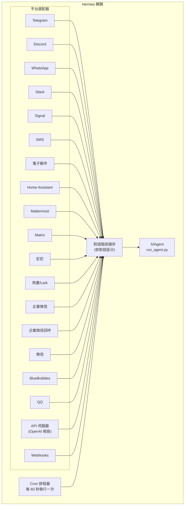

# 訊息網關 (Messaging Gateway)

您可以透過 Telegram、Discord、Slack、WhatsApp、Signal、SMS、電子郵件、Home Assistant、Mattermost、Matrix、釘釘、飛書 (Feishu)/Lark、企業微信 (WeCom)、微信 (Weixin)、BlueBubbles (iMessage)、QQ 或您的瀏覽器與 Hermes 聊天。網關是一個單一的背景程序，它會連線到您所有已設定的平台、處理對話階段 (Session)、執行 Cron 任務並傳遞語音訊息。

有關完整的語音功能集 — 包括 CLI 麥克風模式、通訊軟體中的語音回覆以及 Discord 語音頻道對話 — 請參閱 [語音模式 (Voice Mode)](/docs/user-guide/features/voice-mode) 和 [在 Hermes 中使用語音模式](/docs/guides/use-voice-mode-with-hermes)。

## 平台比較

| 平台 | 語音 | 圖片 | 檔案 | 討論串 | 回應 | 輸入狀態 | 串流 |
|----------|:-----:|:------:|:-----:|:-------:|:---------:|:------:|:---------:|
| Telegram | ✅ | ✅ | ✅ | ✅ | — | ✅ | ✅ |
| Discord | ✅ | ✅ | ✅ | ✅ | ✅ | ✅ | ✅ |
| Slack | ✅ | ✅ | ✅ | ✅ | ✅ | ✅ | ✅ |
| WhatsApp | — | ✅ | ✅ | — | — | ✅ | ✅ |
| Signal | — | ✅ | ✅ | — | — | ✅ | ✅ |
| SMS | — | — | — | — | — | — | — |
| Email | — | ✅ | ✅ | ✅ | — | — | — |
| Home Assistant | — | — | — | — | — | — | — |
| Mattermost | ✅ | ✅ | ✅ | ✅ | — | ✅ | ✅ |
| Matrix | ✅ | ✅ | ✅ | ✅ | ✅ | ✅ | ✅ |
| 釘釘 (DingTalk) | — | — | — | — | — | ✅ | ✅ |
| 飛書 (Feishu)/Lark | ✅ | ✅ | ✅ | ✅ | ✅ | ✅ | ✅ |
| 企業微信 (WeCom) | ✅ | ✅ | ✅ | — | — | ✅ | ✅ |
| 企業微信回呼 | — | — | — | — | — | — | — |
| 微信 (Weixin) | ✅ | ✅ | ✅ | — | — | ✅ | ✅ |
| BlueBubbles | — | ✅ | ✅ | — | ✅ | ✅ | — |
| QQ | ✅ | ✅ | ✅ | — | — | ✅ | — |

**語音** = TTS 語音回覆和/或語音訊息轉錄。**圖片** = 傳送/接收圖片。**檔案** = 傳送/接收檔案附件。**討論串** = 討論串式對話。**回應** = 訊息上的表情符號回應。**輸入狀態** = 處理時顯示正在輸入指示。**串流** = 透過編輯訊息進行漸進式更新。

## 架構



每個平台適配器接收訊息，將其路由到個別對話的儲存區，並將其派發給 AIAgent 進行處理。網關還會運行 Cron 排程器，每 60 秒檢查一次以執行任何到期的任務。

## 快速設定

設定通訊平台最簡單的方法是使用互動式精靈：

```bash
hermes gateway setup        # 互動式設定所有通訊平台
```

這將引導您使用方向鍵選擇並設定各個平台，顯示哪些平台已設定，並在完成後詢問是否要啟動/重啟網關。

## 網關指令

```bash
hermes gateway              # 在前景執行
hermes gateway setup        # 互動式設定通訊平台
hermes gateway install      # 安裝為使用者服務 (Linux) / launchd 服務 (macOS)
sudo hermes gateway install --system   # 僅限 Linux：安裝開機啟動系統服務
hermes gateway start        # 啟動預設服務
hermes gateway stop         # 停止預設服務
hermes gateway status       # 檢查預設服務狀態
hermes gateway status --system         # 僅限 Linux：明確檢查系統服務
```

## 對話指令（在通訊軟體內）

| 指令 | 描述 |
|---------|-------------|
| `/new` 或 `/reset` | 開始全新對話 |
| `/model [provider:model]` | 顯示或變更模型（支援 `provider:model` 語法） |
| `/provider` | 顯示可用供應商及其驗證狀態 |
| `/personality [name]` | 設定人格特質 |
| `/retry` | 重試最後一條訊息 |
| `/undo` | 移除最後一輪對話 |
| `/status` | 顯示對話階段資訊 |
| `/stop` | 停止正在運行的代理 |
| `/approve` | 核准待處理的危險指令 |
| `/deny` | 拒絕待處理的危險指令 |
| `/sethome` | 將此對話設定為主頻道 |
| `/compress` | 手動壓縮對話上下文 |
| `/title [name]` | 設定或顯示對話階段標題 |
| `/resume [name]` | 恢復先前命名的對話階段 |
| `/usage` | 顯示此對話階段的代幣 (Token) 使用量 |
| `/insights [days]` | 顯示使用量見解與分析 |
| `/reasoning [level\|show\|hide]` | 變更推理強度或切換推理顯示 |
| `/voice [on\|off\|tts\|join\|leave\|status]` | 控制語音回覆和 Discord 語音頻道行為 |
| `/rollback [number]` | 列出或還原檔案系統檢查點 |
| `/background <prompt>` | 在獨立的背景階段運行提示詞 |
| `/reload-mcp` | 從設定檔重新載入 MCP 伺服器 |
| `/update` | 將 Hermes Agent 更新至最新版本 |
| `/help` | 顯示可用指令 |
| `/<skill-name>` | 呼叫任何已安裝的技能 |

## 對話階段管理 (Session Management)

### 對話階段持久性

對話階段會跨訊息持續存在，直到被重設。代理會記住您的對話上下文。

### 重設政策

對話階段會根據可設定的政策進行重設：

| 政策 | 預設值 | 描述 |
|--------|---------|-------------|
| 每日 | 4:00 AM | 每日特定時間重設 |
| 閒置 | 1440 分鐘 | 閒置 N 分鐘後重設 |
| 兩者 | (結合) | 以上任一條件先觸發時重設 |

可在 `~/.hermes/gateway.json` 中設定各平台的覆蓋設定：

```json
{
  "reset_by_platform": {
    "telegram": { "mode": "idle", "idle_minutes": 240 },
    "discord": { "mode": "idle", "idle_minutes": 60 }
  }
}
```

## 安全性

**預設情況下，網關會拒絕所有不在允許清單中或未透過私訊配對的使用者。** 對於擁有終端存取權限的機器人，這是安全的預設設定。

```bash
# 限制特定使用者（推薦）：
TELEGRAM_ALLOWED_USERS=123456789,987654321
DISCORD_ALLOWED_USERS=123456789012345678
SIGNAL_ALLOWED_USERS=+155****4567,+155****6543
SMS_ALLOWED_USERS=+155****4567,+155****6543
EMAIL_ALLOWED_USERS=trusted@example.com,colleague@work.com
MATTERMOST_ALLOWED_USERS=3uo8dkh1p7g1mfk49ear5fzs5c
MATRIX_ALLOWED_USERS=@alice:matrix.org
DINGTALK_ALLOWED_USERS=user-id-1
FEISHU_ALLOWED_USERS=ou_xxxxxxxx,ou_yyyyyyyy
WECOM_ALLOWED_USERS=user-id-1,user-id-2
WECOM_CALLBACK_ALLOWED_USERS=user-id-1,user-id-2

# 或允許
GATEWAY_ALLOWED_USERS=123456789,987654321

# 或明確允許所有使用者（不推薦用於具備終端存取權的機器人）：
GATEWAY_ALLOW_ALL_USERS=true
```

### 私訊配對（允許清單的替代方案）

除了手動設定使用者 ID，未知使用者在私訊機器人時會收到一個一次性的配對碼：

```bash
# 使用者看到：「配對碼：XKGH5N7P」
# 您可以使用以下指令核准他們：
hermes pairing approve telegram XKGH5N7P

# 其他配對指令：
hermes pairing list          # 查看待處理與已核准的使用者
hermes pairing revoke telegram 123456789  # 移除存取權限
```

配對碼在 1 小時後過期，設有速率限制，並使用加密隨機產生。

## 中斷代理

在代理工作時傳送任何訊息即可中斷它。關鍵行為：

- **正在執行的終端指令會立即終止** (SIGTERM，1 秒後 SIGKILL)
- **工具呼叫被取消** — 僅目前執行的工具會運行完畢，其餘跳過
- **多條訊息合併** — 中斷期間傳送的訊息會合併為一個提示詞
- **`/stop` 指令** — 僅中斷而不排隊後續訊息

## 工具進度通知

在 `~/.hermes/config.yaml` 中控制顯示多少工具活動：

```yaml
display:
  tool_progress: all    # off | new | all | verbose
  tool_progress_command: false  # 設定為 true 以在通訊軟體中啟用 /verbose
```

啟用後，機器人在工作時會傳送狀態訊息：

```text
💻 `ls -la`...
🔍 web_search...
📄 web_extract...
🐍 execute_code...
```

## 背景對話階段 (Background Sessions)

在獨立的背景階段運行提示詞，讓代理獨立處理，而您的主對話仍保持回應：

```
/background 檢查叢集中的所有伺服器並回報任何斷線的伺服器
```

Hermes 會立即確認：

```
🔄 背景任務已啟動：「檢查叢集中的所有伺服器...」
   任務 ID：bg_143022_a1b2c3
```

### 運作原理

每個 `/background` 提示詞會產生一個**獨立的代理執行個體**並非同步運行：

- **隔離的對話階段** — 背景代理擁有自己的階段與對話歷史。它不知道您目前的對話內容，僅接收您提供的提示詞。
- **相同的設定** — 繼承您目前網關設定的模型、供應商、工具集、推理設定和路由。
- **非阻塞** — 您的主對話保持完全互動。您可以傳送訊息、執行其他指令或啟動更多背景任務。
- **結果傳遞** — 任務完成後，結果會傳回至您發出指令的**同一個對話或頻道**，並帶有「✅ 背景任務完成」前綴。若失敗，您將看到帶有錯誤訊息的「❌ 背景任務失敗」。

### 背景程序通知

當背景階段的代理使用 `terminal(background=true)` 啟動長時間運行的程序（如伺服器、編譯等）時，網關可以將狀態更新推送到您的對話中。這可以透過 `~/.hermes/config.yaml` 中的 `display.background_process_notifications` 進行控制：

```yaml
display:
  background_process_notifications: all    # all | result | error | off
```

| 模式 | 您接收到的內容 |
|------|-----------------|
| `all` | 運行輸出更新 **以及** 最終完成訊息（預設） |
| `result` | 僅最終完成訊息（無論結束代碼為何） |
| `error` | 僅當結束代碼非零時的最終訊息 |
| `off` | 完全不顯示程序監看訊息 |

您也可以透過環境變數設定：

```bash
HERMES_BACKGROUND_NOTIFICATIONS=result
```

### 使用情境

- **伺服器監控** — 「/background 檢查所有服務的健康狀況，如有任何斷線請提醒我」
- **長時間編譯** — 在繼續聊天的同時「/background 編譯並部署測試環境」
- **研究任務** — 「/background 研究競爭對手定價並整理成表格」
- **檔案操作** — 「/background 將 ~/Downloads 中的照片按日期整理到資料夾中」

:::tip
通訊平台上的背景任務是「發出後即不管」的 — 您無需等待或檢查。任務完成後結果會自動傳送到同一個對話中。
:::

## 服務管理

### Linux (systemd)

```bash
hermes gateway install               # 安裝為使用者服務
hermes gateway start                 # 啟動服務
hermes gateway stop                  # 停止服務
hermes gateway status                # 檢查狀態
journalctl --user -u hermes-gateway -f  # 查看日誌

# 啟用 lingering（登出後保持運行）
sudo loginctl enable-linger $USER

# 或安裝開機啟動的系統服務（仍以您的使用者身份執行）
sudo hermes gateway install --system
sudo hermes gateway start --system
sudo hermes gateway status --system
journalctl -u hermes-gateway -f
```

在筆記型電腦或開發機上使用使用者服務。在 VPS 或無頭主機上使用系統服務。

除非確有必要，否則避免同時安裝使用者與系統服務。如果偵測到兩者，Hermes 會發出警告，因為啟動/停止/狀態行為會變得模糊。

:::info 多個安裝
如果您在同一台機器上運行多個 Hermes 安裝（具有不同的 `HERMES_HOME` 目錄），每個安裝都會獲得自己的 systemd 服務名稱。預設的 `~/.hermes` 使用 `hermes-gateway`；其他安裝則使用 `hermes-gateway-<hash>`。`hermes gateway` 指令會自動針對您目前的 `HERMES_HOME` 指定正確的服務。
:::

### macOS (launchd)

```bash
hermes gateway install               # 安裝為 launchd 代理
hermes gateway start                 # 啟動服務
hermes gateway stop                  # 停止服務
hermes gateway status                # 檢查狀態
tail -f ~/.hermes/logs/gateway.log   # 查看日誌
```

產生的 plist 位於 `~/Library/LaunchAgents/ai.hermes.gateway.plist`。它包含三個環境變數：

- **PATH** — 您安裝時的完整 shell PATH，並在前方加上 venv `bin/` 和 `node_modules/.bin`。這確保網關子程序（如 WhatsApp 橋接器）可以使用使用者安裝的工具（Node.js, ffmpeg 等）。
- **VIRTUAL_ENV** — 指向 Python 虛擬環境。
- **HERMES_HOME** — 將網關限定在您的 Hermes 安裝範圍內。

:::tip 安裝後 PATH 變更
launchd plists 是靜態的 — 如果您在設定網關後安裝了新工具（例如透過 nvm 安裝新 Node.js 版本，或透過 Homebrew 安裝 ffmpeg），請再次執行 `hermes gateway install` 以擷取更新後的 PATH。網關將偵測到舊的 plist 並自動重新載入。
:::

## 各平台專屬工具集

每個平台都有自己的工具集：

| 平台 | 工具集 | 能力 |
|----------|---------|--------------|
| CLI | `hermes-cli` | 完全存取 |
| Telegram | `hermes-telegram` | 完整工具（含終端） |
| Discord | `hermes-discord` | 完整工具（含終端） |
| WhatsApp | `hermes-whatsapp` | 完整工具（含終端） |
| Slack | `hermes-slack` | 完整工具（含終端） |
| Signal | `hermes-signal` | 完整工具（含終端） |
| SMS | `hermes-sms` | 完整工具（含終端） |
| 電子郵件 | `hermes-email` | 完整工具（含終端） |
| Home Assistant | `hermes-homeassistant` | 完整工具 + HA 裝置控制 |
| Mattermost | `hermes-mattermost` | 完整工具（含終端） |
| Matrix | `hermes-matrix` | 完整工具（含終端） |
| 釘釘 (DingTalk) | `hermes-dingtalk` | 完整工具（含終端） |
| 飛書/Lark | `hermes-feishu` | 完整工具（含終端） |
| 企業微信 | `hermes-wecom` | 完整工具（含終端） |
| 企業微信回呼 | `hermes-wecom-callback` | 完整工具（含終端） |
| 微信 | `hermes-weixin` | 完整工具（含終端） |
| BlueBubbles | `hermes-bluebubbles` | 完整工具（含終端） |
| QQBot | `hermes-qqbot` | 完整工具（含終端） |
| API 伺服器 | `hermes` (預設) | 完整工具（含終端） |
| Webhooks | `hermes-webhook` | 完整工具（含終端） |

## 下一步

- [Telegram 設定](telegram.md)
- [Discord 設定](discord.md)
- [Slack 設定](slack.md)
- [WhatsApp 設定](whatsapp.md)
- [Signal 設定](signal.md)
- [SMS 設定 (Twilio)](sms.md)
- [電子郵件設定](email.md)
- [Home Assistant 整合](homeassistant.md)
- [Mattermost 設定](mattermost.md)
- [Matrix 設定](matrix.md)
- [釘釘設定](dingtalk.md)
- [飛書/Lark 設定](feishu.md)
- [企業微信設定](wecom.md)
- [企業微信回呼設定](wecom-callback.md)
- [微信設定 (WeChat)](weixin.md)
- [BlueBubbles 設定 (iMessage)](bluebubbles.md)
- [QQBot 設定](qqbot.md)
- [Open WebUI + API 伺服器](open-webui.md)
- [Webhooks](webhooks.md)
