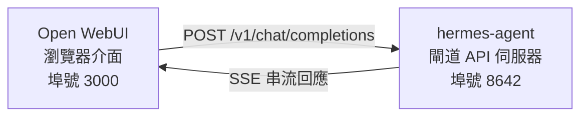

# Open WebUI 整合

[Open WebUI](https://github.com/open-webui/open-webui) (126k★) 是最受歡迎的自託管 AI 對話介面。藉由 Hermes Agent 內建的 API 伺服器，您可以將 Open WebUI 作為代理程式的精緻網頁前端 —— 具備完善的對話管理、使用者帳戶和現代化的聊天介面。

## 架構圖



Open WebUI 連接到 Hermes Agent API 伺服器的方式與連接到 OpenAI 完全相同。您的代理程式會運用其完整的工具集（終端機、檔案操作、網路搜尋、記憶、技能）處理請求，並回傳最終結果。

由於 Open WebUI 與 Hermes 是伺服器對伺服器（server-to-server）通訊，因此在此整合中不需要設定 `API_SERVER_CORS_ORIGINS`。

## 快速設定

### 1. 啟用 API 伺服器

在 `~/.hermes/.env` 中加入：

```bash
API_SERVER_ENABLED=true
API_SERVER_KEY=your-secret-key
```

### 2. 啟動 Hermes Agent 閘道

```bash
hermes gateway
```

您應該會看到：

```
[API Server] API server listening on http://127.0.0.1:8642
```

### 3. 啟動 Open WebUI

```bash
docker run -d -p 3000:8080 \
  -e OPENAI_API_BASE_URL=http://host.docker.internal:8642/v1 \
  -e OPENAI_API_KEY=your-secret-key \
  --add-host=host.docker.internal:host-gateway \
  -v open-webui:/app/backend/data \
  --name open-webui \
  --restart always \
  ghcr.io/open-webui/open-webui:main
```

### 4. 開啟介面

前往 **http://localhost:3000**。建立您的管理員帳號（第一個使用者會成為管理員）。您應該會在模型下拉選單中看到您的代理程式（名稱取自您的設定檔，預設設定檔為 **hermes-agent**）。開始聊天吧！

## Docker Compose 設定

若要進行更持久的設定，請建立 `docker-compose.yml`：

```yaml
services:
  open-webui:
    image: ghcr.io/open-webui/open-webui:main
    ports:
      - "3000:8080"
    volumes:
      - open-webui:/app/backend/data
    environment:
      - OPENAI_API_BASE_URL=http://host.docker.internal:8642/v1
      - OPENAI_API_KEY=your-secret-key
    extra_hosts:
      - "host.docker.internal:host-gateway"
    restart: always

volumes:
  open-webui:
```

然後執行：

```bash
docker compose up -d
```

## 透過管理介面設定

如果您偏好透過網頁介面而非環境變數來設定連線：

1. 登入 Open WebUI (**http://localhost:3000**)
2. 點擊您的 **個人頭像** → **Admin Settings (管理員設定)**
3. 前往 **Connections (連線)**
4. 在 **OpenAI API** 下，點擊 **扳手圖示** (Manage)
5. 點擊 **+ Add New Connection (新增連線)**
6. 輸入：
   - **URL**: `http://host.docker.internal:8642/v1`
   - **API Key**: 您的金鑰或任何非空值（例如 `not-needed`）
7. 點擊 **勾選圖示** 驗證連線
8. **Save (儲存)**

您的代理程式模型現在應該會出現在模型下拉選單中（名稱取自您的設定檔，預設設定檔為 **hermes-agent**）。

:::warning
環境變數僅在 Open WebUI **首次啟動**時生效。之後，連線設定會儲存在其內部資料庫中。若日後要更改，請使用管理介面或刪除 Docker 磁碟卷 (volume) 後重新開始。
:::

## API 類型：對話補全 vs 回應

Open WebUI 在連接後端時支援兩種 API 模式：

| 模式 | 格式 | 何時使用 |
|------|--------|-------------|
| **Chat Completions (對話補全)** (預設) | `/v1/chat/completions` | 推薦使用。開箱即用。 |
| **Responses (回應)** (實驗性) | `/v1/responses` | 用於透過 `previous_response_id` 實現伺服器端對話狀態。 |

### 使用對話補全 (推薦)

這是預設模式，不需要額外設定。Open WebUI 發送標準的 OpenAI 格式請求，Hermes Agent 會相應回應。每個請求都包含完整的對話歷史記錄。

### 使用回應 (Responses) API

若要使用 Responses API 模式：

1. 前往 **Admin Settings** → **Connections** → **OpenAI** → **Manage**
2. 編輯您的 hermes-agent 連線
3. 將 **API Type** 從 "Chat Completions" 更改為 **"Responses (Experimental)"**
4. 儲存

使用 Responses API 時，Open WebUI 會以 Responses 格式（`input` 陣列 + `instructions`）發送請求，而 Hermes Agent 可以透過 `previous_response_id` 在回合之間保留完整的工具調用歷史。當 `stream: true` 時，Hermes 還會串流傳輸規範原生的 `function_call` 和 `function_call_output` 項目，這讓渲染 Responses 事件的客戶端能顯示自訂的結構化工具調用 UI。

:::note
Open WebUI 目前即使在 Responses 模式下也會在客戶端管理對話歷史記錄 —— 它在每個請求中發送完整的訊息歷史，而不是使用 `previous_response_id`。目前 Responses 模式的主要優點是結構化的事件流：文字增量、`function_call` 和 `function_call_output` 項目會作為 OpenAI Responses SSE 事件而非 Chat Completions 區塊到達。
:::

## 運作原理

當您在 Open WebUI 中發送訊息時：

1. Open WebUI 發送一個包含您的訊息和對話歷史的 `POST /v1/chat/completions` 請求
2. Hermes Agent 建立一個具備完整工具集的 AIAgent 實例
3. 代理程式處理您的請求 —— 它可能會調用工具（終端機、檔案操作、網路搜尋等）
4. 當工具執行時，**內嵌的進度訊息會串流到介面**，讓您可以看到代理程式正在做什麼（例如 `` `💻 ls -la` ``, `` `🔍 Python 3.12 release` ``）
5. 代理程式的最終文字回應會串流回 Open WebUI
6. Open WebUI 在其對話介面中顯示回應

您的代理程式擁有與使用 CLI 或 Telegram 時完全相同的工具和能力 —— 唯一的區別在於前端介面。

:::tip 工具進度
啟用串流（預設）後，您會在工具執行時看到簡短的內嵌指標 —— 工具圖示及其關鍵參數。這些會出現在代理程式最終回答之前的回應流中，讓您了解後台發生的情況。
:::

## 設定參考

### Hermes Agent (API 伺服器)

| 變數 | 預設值 | 描述 |
|----------|---------|-------------|
| `API_SERVER_ENABLED` | `false` | 啟用 API 伺服器 |
| `API_SERVER_PORT` | `8642` | HTTP 伺服器埠號 |
| `API_SERVER_HOST` | `127.0.0.1` | 綁定位址 |
| `API_SERVER_KEY` | _(必填)_ | 用於驗證的 Bearer 權杖。須與 `OPENAI_API_KEY` 一致。 |

### Open WebUI

| 變數 | 描述 |
|----------|-------------|
| `OPENAI_API_BASE_URL` | Hermes Agent 的 API 網址 (包含 `/v1`) |
| `OPENAI_API_KEY` | 不能為空。須與您的 `API_SERVER_KEY` 一致。 |

## 疑難排解

### 下拉選單中沒有出現模型

- **檢查網址是否有 `/v1` 字尾**: 應為 `http://host.docker.internal:8642/v1` (不只是 `:8642`)
- **驗證閘道是否正在執行**: `curl http://localhost:8642/health` 應該回傳 `{"status": "ok"}`
- **檢查模型列表**: `curl http://localhost:8642/v1/models` 應該回傳包含 `hermes-agent` 的列表
- **Docker 網路**: 在 Docker 內部，`localhost` 指的是容器本身，而非您的主機。請使用 `host.docker.internal` 或 `--network=host`。

### 連線測試通過但無法載入模型

這幾乎總是漏掉了 `/v1` 字尾。Open WebUI 的連線測試只是基本的連通性檢查 —— 它不會驗證模型列表是否正常工作。

### 回應時間過長

Hermes Agent 在產生最終回應之前，可能會執行多個工具調用（讀取檔案、執行指令、搜尋網路）。對於複雜的查詢，這是正常現象。回應會在代理程式完成所有工作後一次顯示。

### "Invalid API key" 錯誤

確保 Open WebUI 中的 `OPENAI_API_KEY` 與 Hermes Agent 中的 `API_SERVER_KEY` 相符。

## 配合設定檔的多使用者設定

若要為每個使用者執行獨立的 Hermes 實例 —— 每個實例都有自己的設定、記憶和技能 —— 請使用 [設定檔 (Profiles)](/docs/user-guide/features/profiles)。每個設定檔在不同的埠號上執行自己的 API 伺服器，並自動在 Open WebUI 中將設定檔名稱發佈為模型。

### 1. 建立設定檔並配置 API 伺服器

```bash
hermes profile create alice
hermes -p alice config set API_SERVER_ENABLED true
hermes -p alice config set API_SERVER_PORT 8643
hermes -p alice config set API_SERVER_KEY alice-secret

hermes profile create bob
hermes -p bob config set API_SERVER_ENABLED true
hermes -p bob config set API_SERVER_PORT 8644
hermes -p bob config set API_SERVER_KEY bob-secret
```

### 2. 啟動各個閘道

```bash
hermes -p alice gateway &
hermes -p bob gateway &
```

### 3. 在 Open WebUI 中新增連線

在 **Admin Settings** → **Connections** → **OpenAI API** → **Manage** 中，為每個設定檔新增一個連線：

| 連線 | URL | API Key |
|-----------|-----|---------|
| Alice | `http://host.docker.internal:8643/v1` | `alice-secret` |
| Bob | `http://host.docker.internal:8644/v1` | `bob-secret` |

模型下拉選單將顯示 `alice` 和 `bob` 作為不同的模型。您可以透過管理面版將模型分配給 Open WebUI 使用者，讓每個使用者擁有自己獨立的 Hermes 代理程式。

:::tip 自訂模型名稱
模型名稱預設為設定檔名稱。若要覆寫，請在設定檔的 `.env` 中設定 `API_SERVER_MODEL_NAME`：
```bash
hermes -p alice config set API_SERVER_MODEL_NAME "Alice's Agent"
```
:::

## Linux Docker (無 Docker Desktop)

在沒有 Docker Desktop 的 Linux 上，`host.docker.internal` 預設無法解析。選項如下：

```bash
# 選項 1: 加入主機映射
docker run --add-host=host.docker.internal:host-gateway ...

# 選項 2: 使用主機網路
docker run --network=host -e OPENAI_API_BASE_URL=http://localhost:8642/v1 ...

# 選項 3: 使用 Docker 橋接 IP
docker run -e OPENAI_API_BASE_URL=http://172.17.0.1:8642/v1 ...
```
